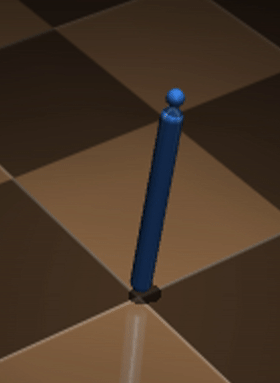

# Supertrack for PyTorch and MUJOCO
This repository is an implementation of Supertrack.

## What is supertrack?
[montreal ubisoft description](https://montreal.ubisoft.com/en/supertrack-motion-tracking-for-physically-simulated-characters-using-supervised-learning/)
[paper](https://doi.org/10.1145/3478513.3480527)

## Dependency
- pytorch
- cv2
- dm_control